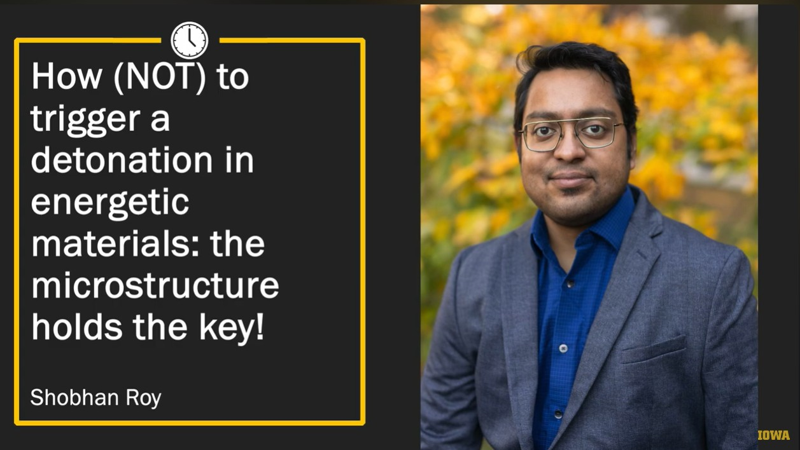

::: {.hero}
::: {}
<div class="eyebrow">Postdoctoral Research Scholar &middot; University of Iowa</div>

# Shobhan Roy

Computational physicist and SciML researcher working on multi-physics modeling and physics-aware AI.

<p class="dek">I'm a postdoctoral researcher at the University of Iowa specializing in shock physics, energetic materials, and physics-aware deep learning. My work spans high-fidelity finite-volume and sharp-interface solver development, production-scale simulation campaigns on DoD HPC systems, and the design of validation benchmarks and surrogate models that connect material microstructure, hotspot dynamics, and continuum response under extreme loading.</p>

<div class="actions">
  <a class="button primary" href="projects/index.qmd">View projects</a>
  <a class="button" href="assets/Shobhan_Roy_Resume.pdf">Download Resume</a>
  <a class="button" href="contact.qmd">Contact</a>
</div>
:::

::: {}
{.headshot fig-alt="Professional headshot of Shobhan Roy"}
:::
:::

::: {.focus-strip}
<div>Sharp-interface multi-material solvers</div>
<div>Production HPC campaigns</div>
<div>Physics-aware deep learning</div>
<div>Microstructure-to-response modeling</div>
:::

::: {.feature}
::: {}
## From microstructure to continuum response

My work connects image-derived microstructures of energetic composites, sharp-interface mesoscale simulation, and physics-aware ML so that surrogate models can be evaluated on quantities that matter physically: pore collapse, hotspot formation, shear localization, shock propagation, damage evolution, and the resulting continuum response under extreme loading.

The site highlights four threads: SCIMITAR3D solver development, production HPC campaigns on DoD systems, the HEDS microstructure-to-sensitivity framework, and physics-aware ML benchmarks for PARC / D-PARC neural surrogates.

Current direction: designing an **agentic microstructure-to-prediction sub-pipeline** as part of a closed-loop materials-discovery framework &mdash; routing imaged and ML-generated microstructures through SCIMITAR3D or PARC-family predictors, with agentic AI orchestration across heterogeneous compute and provenance stores. See [Research](research.qmd) for the current-work detail.
:::

::: {}
```{=html}
<video autoplay loop muted playsinline style="width: 100%; height: auto;" aria-label="Simulated temperature contours showing shock interaction with an HMX crystal-binder microstructure, pore collapse, and shear-band formation.">
  <source src="assets/shock-pore-collapse.mp4" type="video/mp4">
</video>
<div class="caption">Simulation visual from PhD work: flyer-impact shock interaction with an HMX crystal in binder, pore collapse, and shear-band formation.</div>
```
:::
:::

## Featured Projects

::: {.grid}
::: {.card}
### SCIMITAR3D solver development

Sharp-interface, multi-material reactive-flow framework. WENO + ghost-fluid integration cuts the grid-refinement overhead for equivalent accuracy by roughly 2.5&ndash;3&times;.

[Read case study](projects/scimitar3d.qmd)
:::

::: {.card}
### Physics-aware ML benchmarks

DNS ground truth and physics-consistent evaluation for PARC and D-PARC neural surrogates of shocked energetic-material response.

[Read case study](projects/physics-aware-ml.qmd)
:::

::: {.card}
### Production HPC campaigns

Microstructure-resolved mesoscale simulations on DoD HPC systems &mdash; 150M cells, 7,000 cores, ~3M CPU-hours per campaign.

[Read case study](projects/hpc-dns-campaigns.qmd)
:::

::: {.card}
### HEDS framework

Diffusion / U-Net / CycleGAN microstructure generation paired with high-fidelity simulation to study damage&ndash;sensitivity behavior.

[Read case study](projects/heds.qmd)
:::
:::

## Three-minute talk

::: {.video-poster-section}
<a href="research.html#three-minute-primer" class="video-poster">

<span class="redirect-icon" aria-hidden="true">
<svg viewBox="0 0 24 24" width="44" height="44" fill="none" stroke="#fff" stroke-width="2.6" stroke-linecap="round" stroke-linejoin="round">
<path d="M5 20 Q 5 6 18 6"/>
<polyline points="13 2 18 6 13 11"/>
</svg>
</span>
</a>

Three Minute Thesis finalist talk, UIowa Graduate College (2024) &mdash; a non-specialist take on the energetic-materials work.
:::

## Selected Publications

- Beerman, J.T., **Roy, S.**, Udaykumar, H.S., Baek, S.S. - *Size is Not the Solution: Deformable Convolutions for Effective Physics-Aware Deep Learning*, arXiv preprint, 2026. [arXiv:2601.11657](https://arxiv.org/abs/2601.11657)
- **Roy, S.**, Seshadri, P.K., Okafor, C., Johnson, B.P., & Udaykumar, H.S. - *High-Fidelity Simulations of Shock Initiation of an Energetic Crystal-Binder System Due to Flyer Impact*, **Shock Waves** 36(2), 2026. [doi:10.1007/s00193-025-01260-2](https://doi.org/10.1007/s00193-025-01260-2)
- Fang, I., **Roy, S.**, Nguyen, P.C.H., Baek, S.S., Udaykumar, H.S. - *Heterogeneous Energetic Material Damage Simulator (HEDS): A Deep Learning Approach to Simulate Damage-Sensitivity Linkages*, **APL Machine Learning** 3(2), 2025. [doi:10.1063/5.0257683](https://doi.org/10.1063/5.0257683)

[See full publication list](publications.qmd)