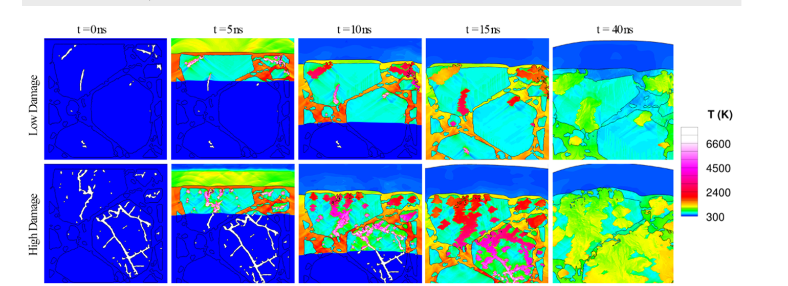

::: {.wide-media}
{fig-alt="HEDS generative output: one damaged PBX microstructure input on the left, with four CycleGAN-generated variants on the right showing increasing levels of damage."}

HEDS generates an ensemble of damaged microstructures from a single input by injecting controlled noise into the CycleGAN component (Fang, **Roy**, et al., [**APL Machine Learning** 3(2), 2025](https://doi.org/10.1063/5.0257683), Fig. 11). The ensemble lets us study how damage level shifts simulation-side response without changing the macroscale geometry.

:::

::: {.wide-media}
{fig-alt="Temperature contours from SCIMITAR3D shock-initiation simulations of two HEDS-generated PBX 9501 microstructures (low damage and high damage) at t = 0, 5, 10, 15, and 40 ns after a 3.3 km/s flyer impact."}

SCIMITAR3D temperature predictions for two HEDS-generated PBX 9501 microstructures with identical macroscale geometry but different damage levels (Fang, **Roy**, et al., [**APL Machine Learning** 3(2), 2025](https://doi.org/10.1063/5.0257683), Fig. 13). Five timesteps (0, 5, 10, 15, 40 ns) after a 3.3 km/s flyer impact; the higher-damage case shifts both hotspot intensity and extent.

:::

**Role:** Simulation and physics-validation lead. ML architecture and training led by collaborators (Fang, Nguyen, Baek).

## Problem

Energetic-material sensitivity is controlled by how microstructure concentrates energy under shock loading: where pores collapse, how damage accumulates, whether a hotspot grows or decays. The practical question is direct: given a synthetic or imaged microstructure, can we predict whether it is more or less likely to ignite under shock &mdash; with physics constraints baked in rather than learned by accident?

## Technical Approach

HEDS pairs deep generative microstructure modeling with computational mechanics. ML-generated microstructures (diffusion models, U-Net, CycleGAN) feed into high-fidelity simulations, and the simulation response is used to evaluate and interpret the learned representations. My contribution centered on the simulation and physics-validation side: curating high-fidelity simulation outputs, defining physically grounded evaluation criteria, and analyzing damage&ndash;sensitivity behavior on the generated structures. ML architecture and training were led by collaborators (co-developed with 2 PhD students).

## Scale and Constraints

The pipeline needed simulation-ready microstructures, physically grounded response quantities (pressure/temperature field evolution, hotspot statistics), and a comparison workflow for synthetic vs. imaged microstructures that respected conservation and damage-mechanics constraints.

## Validation

Validation asked whether generated microstructures preserved physically meaningful trends in damage, hotspot formation, and shock response &mdash; not just visual realism. SCIMITAR3D simulation outputs served as ground-truth anchors.

## Outcome

- **Publication:** *Heterogeneous Energetic Material Damage Simulator (HEDS)* in **APL Machine Learning** 3(2), 2025 ([doi:10.1063/5.0257683](https://doi.org/10.1063/5.0257683)).
- **Topical context:** HEDS sits in a broader thread of physics-aware ML for energetic materials at Iowa and partner institutions, alongside parallel work on the PARC and D-PARC architectures (separate UVA collaboration).

## Links

- Fang, **Roy**, Nguyen, Baek, Udaykumar &mdash; *Heterogeneous Energetic Material Damage Simulator (HEDS)*, **APL Machine Learning** 3(2), 2025. [doi:10.1063/5.0257683](https://doi.org/10.1063/5.0257683)
- Code: [github.com/ifang0/HEDS](https://github.com/ifang0/HEDS) (collaborator repo, I. Fang et al.).