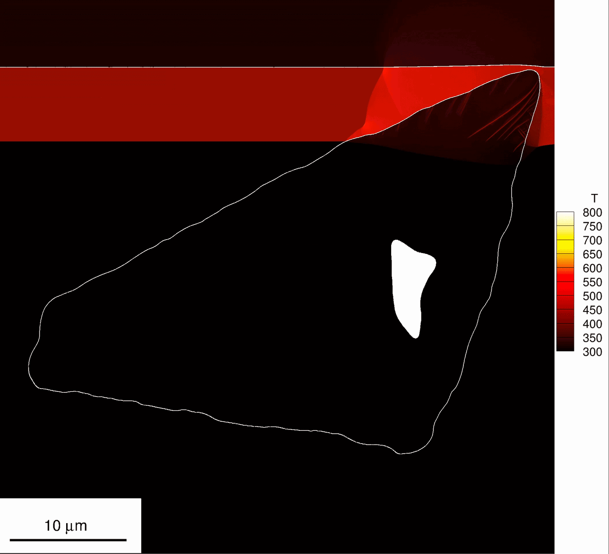

::: {.wide-media}
{fig-alt="Snapshot from a production-scale SCIMITAR3D run: shock interaction with an HMX crystal-binder configuration on a microstructure-resolved grid."}

Snapshot from a 150M-cell production campaign on DoD HPC: shock front interacting with a microstructure-resolved HMX-binder configuration during early initiation.

:::

## Problem

Energetic-material initiation is governed by small, rare, localized events: pore collapse, shear localization, and hotspot growth at sub-grain scale. To compare simulations meaningfully with experiments and with learned surrogates, the computation must resolve those features rather than average them away.

## Technical Approach

I designed and managed production-scale reactive multi-material simulation campaigns using SCIMITAR3D on DoD HPC systems. The campaigns resolved crystal&ndash;binder interfaces, voids, shock interaction, and hotspot evolution in microstructure-aware HMX-based PBX configurations &mdash; with constitutive models and resolution criteria selected for head-to-head comparison against experimental observations.

## Scale and Constraints

- **Grid:** 150M cells
- **Concurrency:** 7,000 CPU cores
- **Compute:** ~3M CPU-hours per representative campaign
- **Grid resolution:** 15 nm on mesoscale sub-samples (50 &times; 70 &mu;m, 1&ndash;2 energetic crystals), with subsequent campaigns at 10 nm
- **Why this scale:** hotspot statistics approached a grid-converged threshold only when sub-micron microstructural features were explicitly resolved &mdash; under that, the answers move with grid, not with physics.

## Validation

Campaigns were tied to experiments and collaborator observations from UIUC (Dlott group) and Los Alamos National Laboratory, with simulation design driven by head-to-head comparison, resolution criteria, and physically interpretable observables (burn-front velocity, energy localization, ignition thresholds).

## Outcome

- **Publications:** *Hot Spot Ignition and Growth&hellip;*, **Journal of Applied Physics** 131(20), 2022; *High-Fidelity Simulations of Shock Initiation&hellip;*, **Shock Waves** 36(2), 2026 ([doi:10.1007/s00193-025-01260-2](https://doi.org/10.1007/s00193-025-01260-2)).
- **Datasets:** ground-truth DNS databases now reused for physics-aware ML benchmarking (PARC / D-PARC).
- **Programs:** simulation contributions to **AFOSR-MURI** *Microstructurally-Aware Continuum Models for Energetic Materials* (7-institution consortium, 2019&ndash;2024) and **ONR-MURI** *Non-Equilibrium Energy Propagation/Transfer in Condensed-Phase Exothermic Reactions* (2025&ndash;present).