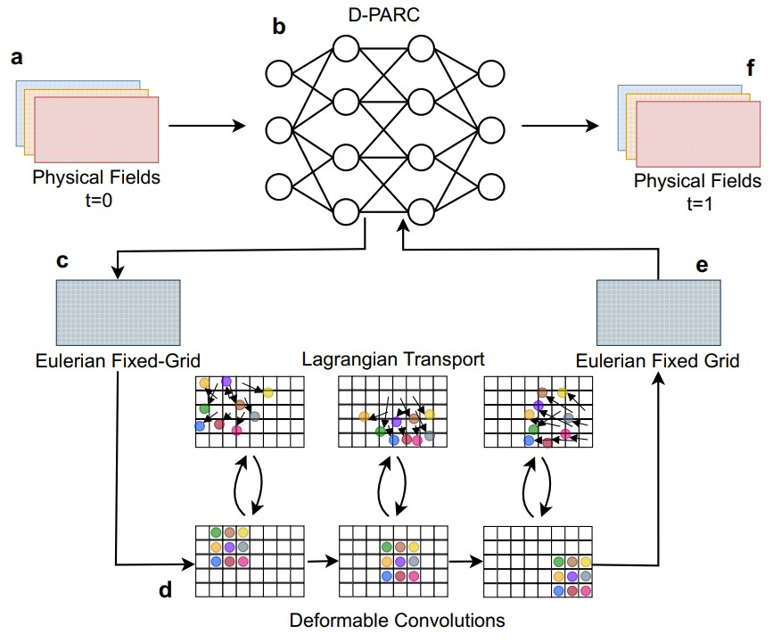
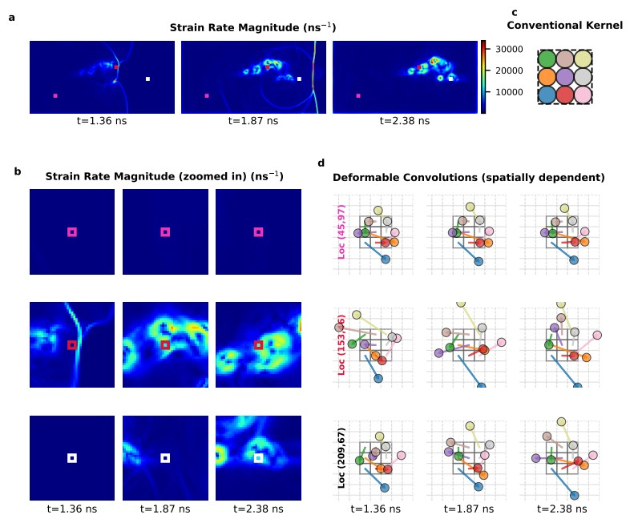

::: {.figure-pair .equal}
::: {.wide-media}
{fig-alt="Schematic of the D-PARC architecture. Physical fields on a fixed Eulerian grid feed into the recurrent neural network at top. A separate feature branch produces per-pixel sampling offsets that move convolution kernel elements off the regular grid (the 'Lagrangian Transport' middle row), and bilinear interpolation projects the result back onto a structured Eulerian grid for the next timestep."}

Figure 5 from Beerman, **Roy**, et al. (2026): D-PARC's hybrid Lagrangian&ndash;Eulerian flow. Physical fields enter on a fixed Eulerian grid (a); the recurrent network (b) produces per-pixel offset fields that displace convolution kernels from their regular positions and let them sample at adaptive locations across the domain ("Lagrangian Transport"); bilinear interpolation projects the result back onto the structured Eulerian grid (e) for the next timestep (f). The grid stays as the computational scaffold &mdash; the kernels do the adaptive work.

:::

::: {.wide-media}
{fig-alt="D-PARC kernel adaptation visualized across three locations in a shocked HMX energetic-material simulation. Top: strain-rate magnitude field at three timesteps with three sampled locations marked, alongside a conventional 3x3 convolution kernel for reference. Bottom: zoomed strain-rate field at each location (left half) and the corresponding deformed-kernel configurations (right half). Kernels at the shock front expand substantially; kernels in low-strain regions remain compact."}

Figure 2 from Beerman, **Roy**, et al. (2026): D-PARC's "active filtration" in action on the energetic-material problem. **Top (a, c):** strain-rate field at three timesteps with three sampled locations marked; conventional 3&times;3 kernel shown for reference. **Bottom (b, d):** zoomed strain (left) and corresponding deformed-kernel configurations (right) at each location across the same three timesteps. Kernels expand substantially at the shock front (middle row, Loc 153,46 at t = 1.87 ns) and stay compact in the low-strain region (top row) &mdash; emergent behavior, not hard-coded.

:::
:::

**Role:** Co-architected D-PARC (Beerman, **Roy**, Udaykumar, Baek, 2026); simulation-side lead for the UVA (Baek group) collaboration on DNS curation and physics-consistency benchmarks.

## Problem

CNN-based surrogates for shock-driven multi-physics flows sample on a fixed Cartesian grid &mdash; a direct inheritance from computer vision. Classical computational mechanics started from the same Eulerian footing, but spent decades developing tools for problems where sharp gradients aren't aligned with the grid: high-order shock-capturing flux schemes (WENO, PPM) for fluids, body-fitted curvilinear meshes for oblique material interfaces in solid mechanics, adaptive mesh refinement, and Hybrid Lagrangian&ndash;Eulerian methods (PIC, ALE, IBM) where particles transport state across a structured background. Vanilla CNNs inherit none of that adaptivity. Scaling model parameters &mdash; the broader AI community's default &mdash; adds capacity but doesn't give the network a way to follow features where the physics is sharp. The architectural question for physics-aware deep learning is whether one of those classical adaptations can be brought *inside* the network itself.

## Technical Approach

My contribution to PARC-family research sits in two pillars.

**D-PARC co-architecture.** I co-architected **D-PARC** &mdash; a physics-aware deformable-convolution neural operator built on the PARC (Physics-Aware Recurrent Convolutions) family for emulation of high-speed nonlinear transport &mdash; contributing the conceptual analogy between hybrid Lagrangian&ndash;Eulerian flow-solver schemes and the deformable-convolution operator (Beerman, **Roy**, Udaykumar, Baek, arXiv 2026). The analogy lets the network adapt its spatial receptive field to local advective structure the way an adaptive solver tracks features.

**DNS benchmarks and physics-consistent evaluation.** As the simulation-side lead for the University of Virginia (Baek group) collaboration, I curate ground-truth DNS databases across canonical flow problems (Burgers, Navier&ndash;Stokes) and energetic-material regimes, select simulation parameters to maximize physical coverage, and define the evaluation protocols used to score both PARC and D-PARC. In parallel, I build data-driven surrogates and closure relations that link mesoscale hotspot metrics to macroscale continuum predictions.

## Scale and Constraints

- DNS data spanning canonical flows and microstructure-resolved shock-initiation regimes.
- Evaluation must penalize physics-violating predictions, not just visual similarity.
- Surrogate models targeted at use *inside* multi-scale simulation workflows, where unphysical predictions break downstream solvers.

**Tech stack:** Python &middot; PyTorch (incl. PARCtorch) &middot; TensorFlow &middot; SCIMITAR3D-derived DNS pipelines &middot; HPC scheduling and parallel I/O.

## Validation

Models are scored against held-out DNS using metrics chosen to fail loudly when physics is violated: field-level RMSE on velocity / pressure / temperature, spatial-overlap measures (IoU, Dice) on hotspot geometry, an IoU-weighted RMSE that penalizes joint mis-localization and thermal error, and Effective Receptive Field analysis that diagnoses where each model actually draws information from. The goal is to distinguish architectural wins from parameter-count wins.

## Forward thread

D-PARC addresses the architectural side; the harder long-game in this space is **evaluation**. Neural surrogates for transient, shock-driven multi-physics problems are still routinely judged on image-similarity metrics that ignore the governing PDEs &mdash; models that look right and predict wrong, with conservation, interface conditions, and entropy constraints quietly violated. For surrogates to be trustworthy *inside* materials and simulation pipelines, both the architecture and the evaluation have to be physics-consistent, not pixel-consistent. The DNS-curation work above is groundwork for that alternative; see the [Research](../research.qmd) page for this thread in fuller form.

## Outcome

- **Preprint:** Beerman, **Roy**, Udaykumar, Baek &mdash; *Size is Not the Solution: Deformable Convolutions for Effective Physics-Aware Deep Learning*, arXiv preprint, 2026 ([arXiv:2601.11657](https://arxiv.org/abs/2601.11657)).
- **Teaching:** TA (University of Iowa side) for the *Physics-Aware Deep Learning &mdash; PINNs, neural operators, PARC, reduced-order models* course offered jointly with the UVA School of Data Science (Spring 2026).

## Links

- Beerman, **Roy**, Udaykumar, Baek &mdash; *Size is Not the Solution&hellip;*, [arXiv:2601.11657](https://arxiv.org/abs/2601.11657), 2026.
- Code: [github.com/baeklab/PARCtorch](https://github.com/baeklab/PARCtorch) (Baek lab; PARC family and D-PARC implementations).
- Related dataset / pipeline: see the [HEDS framework](heds.qmd) and [HPC campaigns](hpc-dns-campaigns.qmd) projects.
