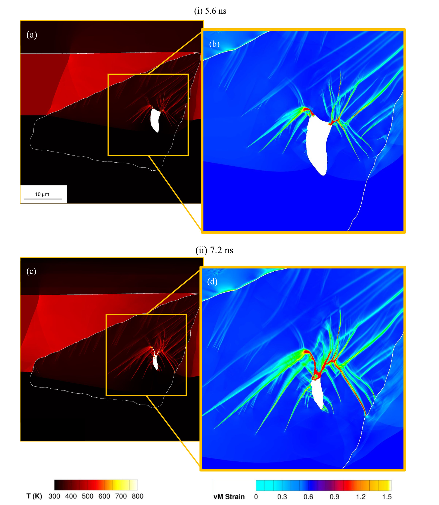

::: {.wide-media}
{fig-alt="SCIMITAR3D simulation of an HMX crystal in binder under flyer-impact shock, at 5.6 ns and 7.2 ns. Left column: temperature contours showing the explicit Al flyer and crystal-binder interface. Right column: zoomed-in von Mises strain showing localization at sub-grain scale."}

SCIMITAR3D simulation of flyer-impact shock initiation on an HMX crystal in binder (Roy et al., [**Shock Waves** 36(2), 2026](https://doi.org/10.1007/s00193-025-01260-2), Fig. 9). Left column: temperature contours with the Al flyer and sharp crystal-binder interface explicitly tracked. Right column: zoomed-in von Mises strain showing localization at sub-grain scale. Rows compare 5.6 ns and 7.2 ns after impact.

:::

**Role:** Multi-material extension contributor &mdash; helped integrate fifth-order WENO reconstruction and Riemann-based ghost-fluid coupling; lead author on the validation paper (*High-Fidelity Simulations&hellip;*, **Shock Waves** 2026).

## Problem

Shock-to-detonation transition in heterogeneous energetic materials depends on strongly localized physics: crystal-binder interfaces, void collapse, hotspot growth, and reactive wave coupling. Coarse or overly diffusive simulation methods can miss the sub-grain features that determine whether a local event grows or decays.

## Technical Approach

I extended SCIMITAR3D into a multi-component, sharp-interface framework for high-speed reactive multi-material dynamics. Core contributions: integration of full fifth-order WENO reconstruction and Riemann-based ghost-fluid coupling for multi-material interface tracking, plus mesoscale solver workflows for energetic-material geometries derived from imaged microstructures. Postdoc-era extensions include novel interfacial treatments for materials transitioning from solid-with-strength to hydrodynamic flow during chemical decomposition, and augmentation of JWL and Mie–Gr&uuml;neisen equations of state to span the full tensile-to-high-compression pressure range needed for macroscale shock-to-detonation runs.

## Scale and Constraints

The solver had to support reactive compressible flow, sharp material interfaces, stiff thermo-chemical kinetics, and production runs on university and DoD HPC systems. A primary engineering constraint: reduce numerical diffusion without driving grid requirements out of reach for microstructure-resolved campaigns.

**Tech stack:** Fortran 90 / C++ / Python · MPI with domain decomposition · Slurm / PBS · parallel I/O · DoD HPC clusters.

## Validation

Simulation predictions were validated against experimental observations from collaborators at UIUC (Dlott group) and Los Alamos National Laboratory. Validation centered on physically meaningful observables: hotspot formation, shock response, burn-front velocity, and sensitivity trends under controlled flyer-impact loading.

## Outcome

- **Engineering win:** the WENO + Riemann-based ghost-fluid integration eliminates the roughly 2.5&ndash;3&times; grid-refinement overhead otherwise required for equivalent accuracy at lower order &mdash; a direct cost reduction for every downstream campaign.
- **Capability:** SCIMITAR3D is now the simulation backbone for multiple PhD and postdoctoral threads, including the HEDS dataset pipeline and current physics-aware deep learning benchmarks.
- **Publications:** two **Shock Waves** journal papers &mdash; one on shock initiation of an HMX crystal&ndash;binder system (published 2026); one on high-order multi-material methods (accepted, in production, 2026).

## Links

- Okafor, Seshadri, **Roy**, Udaykumar &mdash; *High-Order Eulerian Sharp Interface Numerical Techniques&hellip;*, **Shock Waves** (in production, 2026).
- **Roy**, Seshadri, Okafor, Johnson, Udaykumar &mdash; *High-Fidelity Simulations of Shock Initiation of an Energetic Crystal&ndash;Binder System Due to Flyer Impact*, **Shock Waves** 36(2), 2026 ([doi:10.1007/s00193-025-01260-2](https://doi.org/10.1007/s00193-025-01260-2)).
- Talk: *SCIMITAR3D-V2.0*, APS SCCM 2025.
- *Code: SCIMITAR3D is group-internal (Udaykumar lab, University of Iowa); access by inquiry.*